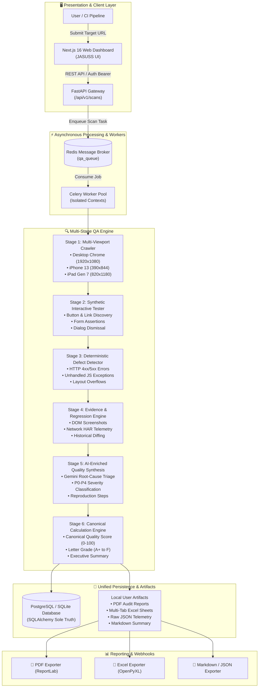
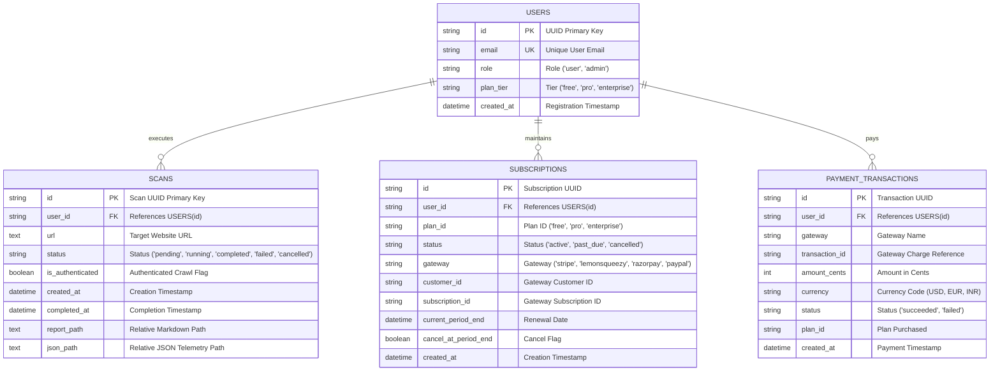

# 🛡️ JASUSS — Enterprise Web Quality Assurance Platform
### *Continuous Automated Testing, Multi-Viewport Verification & Defect Triage*
**Powered by Nexus Engine**

[](LICENSE)
[](https://fastapi.tiangolo.com)
[](https://nextjs.org)
[](https://playwright.dev)
[](https://docs.celeryq.dev)
[](https://pytest.org)

---

## 📖 Table of Contents

- [Overview](#-overview)
- [System Architecture & Data Flow Diagram (DFD)](#-system-architecture--data-flow-diagram-dfd)
- [Database Schema (Entity-Relationship Diagram)](#-database-schema-entity-relationship-diagram)
- [Key Features & Capabilities](#-key-features--capabilities)
- [Subscription & Multi-Payment Gateways](#-subscription--multi-payment-gateways)
- [Technology Stack](#-technology-stack)
- [Repository Structure](#-repository-structure)
- [Getting Started & Local Development](#-getting-started--local-development)
- [Admin Console & Telemetry](#-admin-console--telemetry)
- [Running Automated Tests](#-running-automated-tests)
- [Contributing & Open Source Guidelines](#-contributing--open-source-guidelines)

---

## 🌟 Overview

**JASUSS** is an end-to-end automated web quality assurance suite designed for software development teams, QA engineers, and high-velocity SaaS products. Powered by the **Nexus Engine**, JASUSS autonomously audits web applications across multiple viewports (Desktop, Mobile, Tablet), executes synthetic interactive journeys, intercepts client-side and network defects, performs AI-assisted root cause triage, and delivers compliance audit reports with a single click.

---

## 📐 System Architecture & Data Flow Diagram (DFD)

The following diagram illustrates how JASUSS orchestrates multi-viewport crawling, synthetic user interactions, defect triage, AI synthesis, and report exports:



---

## 🗄️ Database Schema (Entity-Relationship Diagram)

SQLAlchemy is the sole source of truth for all users, scans, subscriptions, and financial transactions:



---

## 🚀 Key Features & Capabilities

1. **Multi-Viewport Cross-Device Crawling**:
   - Simultaneous parallel crawling across **Desktop (1920×1080)**, **iPhone 13 (390×844)**, and **iPad Gen 7 (820×1180)**.
   - Evaluates horizontal layout overflows, element clipping, and viewport breakpoints.

2. **Deterministic Interactive Testing**:
   - Automatically uncovers interactive controls (buttons, links, form inputs) and verifies state changes, client-side routing, and modal transitions.

3. **Secure Authenticated Crawling**:
   - Supports form-based authentication (`login_url`, `username`, `password`) using Pydantic `SecretStr` transient memory. Zero password leakage into databases, server logs, or report artifacts.

4. **Canonical Calculation Engine**:
   - Single source of truth for QA metrics (`calculation_engine.py`):
     - Normalized Pass/Fail rates.
     - Deterministic Health Score (0–100) and Letter Grade (A+, A, B, C, D, F).
     - Weighted severity penalties (Critical: 25 pts, High: 15 pts, Medium: 7 pts, Low: 2 pts).

5. **Executive Multi-Format Exports**:
   - One-click downloads for:
     - **PDF Reports**: Formal executive audit with visual score gauges and remediation tables.
     - **Excel Workbooks**: Structured multi-tab spreadsheets (`Overview`, `Findings`, `Test Cases`, `Responsive Matrix`).
     - **JSON & Markdown**: Complete raw telemetry for CI/CD integrations.

6. **Interactive Stop / Cancel Scan**:
   - Real-time scan abort controls directly from the scanning monitor via `POST /api/v1/scans/{id}/cancel`.

---

## 💳 Subscription & Multi-Payment Gateways

JASUSS includes built-in multi-gateway payment processing supporting **Stripe**, **LemonSqueezy**, **Razorpay**, and **PayPal**:

| Plan Tier | Price | Scans / Month | Page Crawl Depth | Key Features |
| :--- | :--- | :--- | :--- | :--- |
| **Community Starter** | **$0** (Free) | 10 Scans | Up to 10 Pages | Multi-viewport crawling, defect triage, web quality score |
| **Professional QA** | **$49 / mo** | 200 Scans | Up to 50 Pages | Authenticated crawling, PDF & Excel exports, priority queue |
| **Enterprise Suite** | **$199 / mo** | Unlimited | Deep Discovery | Dedicated worker node, custom auth, 24/7 SLA, custom rules |

### Supported Gateways:
- 💳 **Stripe**: Credit/Debit Cards, Apple Pay, Google Pay (`StripeAdapter`).
- 🛍️ **LemonSqueezy**: Merchant of Record with global tax handling (`LemonSqueezyAdapter`).
- ⚡ **Razorpay**: UPI, NetBanking, International Cards (`RazorpayAdapter`).
- 💵 **PayPal**: PayPal Wallet & Express Checkout (`PayPalAdapter`).

---

## 🛠️ Technology Stack

- **Backend Framework**: Python 3.12+, FastAPI, Pydantic V2, Uvicorn
- **Browser Automation**: Playwright (Headless Chromium)
- **Task Queue & Broker**: Celery, Redis
- **Database & ORM**: SQLAlchemy, PostgreSQL / SQLite, Alembic Migrations
- **AI Synthesis**: Google Gemini AI (`gemini-2.5-flash` / `gemini-3-flash-preview`)
- **Reporting Engines**: ReportLab (PDF), OpenPyXL (Excel)
- **Frontend Architecture**: Next.js 16 (Turbopack, App Router), React 19, TypeScript
- **Styling & Animations**: Vanilla CSS Modules (Glassmorphism & Luxury Dark Mode), Framer Motion, Lucide Icons
- **Authentication**: Supabase Auth (JWT Bearer Token Validation)

---

## 📂 Repository Structure

```text
ai-qa-agent/
├── api/                        # FastAPI Route Controllers
│   ├── main.py                 # Core API & Scan Pipeline Engine
│   ├── billing.py              # Subscription & Multi-Gateway Checkout Endpoints
│   ├── admin.py                # Admin Telemetry & Platform Metrics
│   └── rate_limiter.py         # Client IP & User Rate Limiting
├── billing/                    # Payment Gateway Adapters
│   ├── __init__.py
│   └── gateways.py             # Stripe, LemonSqueezy, Razorpay, PayPal Adapters
├── crawler/                    # Multi-Viewport Crawler
│   └── crawler.py              # Playwright Desktop, Mobile, Tablet Engine
├── security/                   # Sensitive Data Sanitization
│   └── redactor.py             # Zero-Leakage SecretStr & PII Redactor
├── worker/                     # Asynchronous Queue Workers
│   ├── celery_app.py           # Celery Broker & Queue Setup
│   └── tasks.py                # Distributed Scan Task Runner
├── web/                        # Next.js 16 Frontend Web Application
│   ├── src/app/
│   │   ├── layout.tsx          # Root Metadata & Fonts
│   │   ├── page.tsx            # JASUSS Dashboard, Scanner, Admin & Pricing UI
│   │   └── page.module.css     # Luxury Dark Mode & Responsive Styling
│   └── next.config.ts          # Turbopack & API Proxy Rewrites
├── alembic/                    # Database Migrations
├── tests/                      # Pytest Test Suites (154+ Automated Tests)
├── calculation_engine.py       # Single Source of Truth for QA Metrics
├── bug_detector.py             # Deterministic Anomaly & Defect Trapper
├── bug_triage.py               # Severity & Priority Engine
├── evidence_engine.py          # Screenshot & Network Evidence Engine
├── gemini_analyzer.py          # AI Root-Cause & Verification Engine
├── interactive_tester.py       # Synthetic Interaction Runner
├── qa_report_generator.py      # PDF, Excel, JSON & Markdown Exporter
├── run_qa.py                   # Standalone CLI QA Pipeline
├── start.sh                    # Interactive Foreground Launcher
├── Dockerfile                  # Production Docker Container
├── render.yaml                 # Render Cloud Deployment Blueprint
└── README.md                   # Platform Documentation
```

---

## ⚡ Getting Started & Local Development

### 1. Prerequisites
- Python `3.10+` (Python `3.12` recommended)
- Node.js `18+` and `npm`
- Redis (or local mock broker)

### 2. Clone & Install Dependencies
```bash
# Clone the repository
git clone https://github.com/jay-sambhu/QA-For-lms.git
cd QA-For-lms

# Install Python dependencies & Playwright Chromium
pip install -r requirements.txt
playwright install chromium

# Install Next.js frontend dependencies
npm install --prefix web
```

### 3. Configure Environment Variables
Create a `.env` file in the root directory:
```env
ENVIRONMENT=development
DATABASE_URL=sqlite:///./qa_agent.db
REDIS_URL=redis://localhost:6379/0
GEMINI_API_KEY=your_gemini_api_key_here

# Optional: Supabase Auth
NEXT_PUBLIC_SUPABASE_URL=https://your-project.supabase.co
NEXT_PUBLIC_SUPABASE_ANON_KEY=your_anon_key_here

# Optional: Payment Gateway Keys
STRIPE_SECRET_KEY=sk_test_...
LEMONSQUEEZY_API_KEY=...
RAZORPAY_KEY_ID=...
PAYPAL_CLIENT_ID=...
```

### 4. Start Interactive Development Servers
Use the included foreground terminal launcher to monitor live API requests and compilation logs:
```bash
chmod +x start.sh
./start.sh
```

- 🌐 **Web Application**: `http://localhost:3000`
- 🔌 **API Documentation (Swagger UI)**: `http://localhost:8000/docs`

---

## 📊 Admin Console & Telemetry

Click **"Admin Console"** in the top navigation bar to open the live operations dashboard:
- **MRR & Financial Analytics**: Real-time revenue, active paid subscriptions, and transaction logs.
- **Tenant Management**: View registered users, active plan tiers (`Free`, `Pro`, `Enterprise`), and scan history.
- **Global Scan Pipeline Inspector**: Live visibility into all running, completed, and failed scans.
- **System Telemetry**: Real-time CPU load, memory utilization, and Celery worker node health.

---

## 🧪 Running Automated Tests

Run the full pytest suite across calculation engines, database migrations, security sanitizers, payment gateways, and report exporters:

```bash
# Run entire test suite
pytest -q

# Run specific test modules
pytest -q tests/test_billing_gateways.py tests/test_admin_api.py
pytest -q test_calculation_engine.py test_auth_crawl.py
```

---

## 🤝 Contributing & Open Source Guidelines

We welcome contributions from developers worldwide!

1. **Fork the Repository**.
2. **Create a Feature Branch** (`git checkout -b feat/amazing-feature`).
3. **Commit your Changes** (`git commit -m 'feat: add amazing feature'`).
4. **Push to the Branch** (`git push origin feat/amazing-feature`).
5. **Open a Pull Request**.

Please ensure all tests pass (`pytest -q`) and Next.js builds cleanly (`npm run build --prefix web`) before submitting your PR.

---

## 📄 License

This project is licensed under the **MIT License** — see the [LICENSE](LICENSE) file for details.

*Engineered with precision by the JASUSS Team · Powered by Nexus.*
