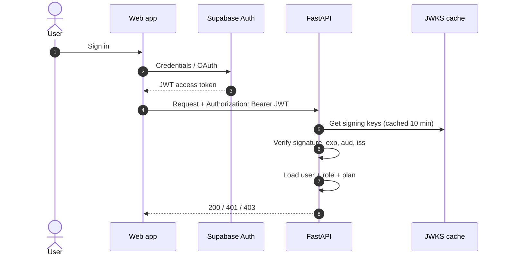

# API Reference

> **Status note:** `POST /api/v1/scans`, `POST /api/v1/scans/{id}/cancel`, billing and admin routes are documented in the project README. Other routes and all schemas below are the **recommended contract**; reconcile with the FastAPI OpenAPI output at `/docs` and treat `/openapi.json` as authoritative.

Base URL: `https://api.example.com/api/v1`

## 1. Authentication



- Interactive clients: `Authorization: Bearer <JWT>`
- CI/automation: `X-API-Key: jsk_live_…` (hashed at rest, scoped, revocable)
- Roles: `user`, `admin`. Admin routes return `403` for non-admins.

## 2. Conventions

- JSON only, UTF-8, ISO-8601 UTC timestamps, UUID identifiers.
- Pagination: `?limit=20&cursor=<opaque>`; response includes `next_cursor`.
- Idempotency: `POST /scans` and `POST /billing/checkout` accept `Idempotency-Key`.
- Every response carries `X-Request-ID`; include it in support requests.

## 3. Endpoints

### Scans

| Method | Path | Auth | Description |
|---|---|---|---|
| `POST` | `/scans` | user | Create scan, returns `202` |
| `GET` | `/scans` | user | List own scans |
| `GET` | `/scans/{id}` | owner/admin | Status, score, summary |
| `GET` | `/scans/{id}/findings` | owner/admin | Paginated findings, filter by severity/viewport |
| `POST` | `/scans/{id}/cancel` | owner/admin | Cancel pending/running scan |
| `GET` | `/scans/{id}/report?format=` | owner/admin | `pdf`, `xlsx`, `json`, `md`; redirects to presigned URL |
| `DELETE` | `/scans/{id}` | owner/admin | Delete scan and artifacts |

**Create scan request**

```json
{
  "url": "https://staging.example.com",
  "max_pages": 25,
  "viewports": ["desktop", "mobile", "tablet"],
  "auth": {
    "login_url": "https://staging.example.com/login",
    "username": "qa@example.com",
    "password": "•••••••"
  }
}
```

`auth` is optional. The password is accepted as a write-only `SecretStr`, kept in memory for the scan, never stored or logged.

**Create scan response `202`**

```json
{
  "id": "6f1c…",
  "status": "pending",
  "url": "https://staging.example.com",
  "created_at": "2026-09-20T10:15:00Z"
}
```

**Scan detail response**

```json
{
  "id": "6f1c…",
  "status": "completed",
  "progress_pct": 100,
  "quality_score": 82,
  "grade": "B",
  "counts": { "P0": 0, "P1": 2, "P2": 5, "P3": 9, "P4": 3 },
  "viewports": [
    { "name": "desktop", "pages_crawled": 25, "overflow_count": 0 },
    { "name": "mobile", "pages_crawled": 25, "overflow_count": 4 }
  ],
  "regressions_vs_baseline": 1,
  "completed_at": "2026-09-20T10:19:41Z"
}
```

### Billing

| Method | Path | Auth | Description |
|---|---|---|---|
| `GET` | `/billing/plans` | public | Plans and limits |
| `POST` | `/billing/checkout` | user | Create checkout session `{plan_id, gateway}` |
| `GET` | `/billing/subscription` | user | Current subscription |
| `POST` | `/billing/cancel` | user | Cancel at period end |
| `POST` | `/billing/webhooks/{gateway}` | signature | Gateway webhooks (no JWT) |

### Admin

| Method | Path | Description |
|---|---|---|
| `GET` | `/admin/metrics` | MRR, active subs, scan volume, worker health |
| `GET` | `/admin/users` | Tenant list, plan tiers |
| `GET` | `/admin/scans` | Global scan inspector |

### System

| Method | Path | Description |
|---|---|---|
| `GET` | `/healthz` | Liveness: process is up |
| `GET` | `/readyz` | Readiness: DB and Redis reachable |
| `GET` | `/metrics` | Prometheus (internal network only) *(Planned: Phase 4)* |

## 4. Error model

RFC 7807 style:

```json
{
  "type": "https://docs.example.com/errors/quota-exceeded",
  "title": "Monthly scan quota exceeded",
  "status": 402,
  "code": "QUOTA_EXCEEDED",
  "detail": "Free plan allows 10 scans per month.",
  "request_id": "9b2d…"
}
```

| Status | `code` | Meaning |
|---|---|---|
| 400 | `BAD_REQUEST` | Malformed body |
| 401 | `UNAUTHENTICATED` | Missing/invalid/expired token |
| 402 | `QUOTA_EXCEEDED` | Plan limit reached |
| 403 | `FORBIDDEN` | Not owner / not admin |
| 404 | `NOT_FOUND` | Unknown id (also used for other users' resources) |
| 409 | `INVALID_STATE` | e.g. cancel on completed scan |
| 422 | `URL_NOT_ALLOWED` / `VALIDATION_ERROR` | SSRF guard or schema violation |
| 429 | `RATE_LIMITED` | Includes `Retry-After` |
| 503 | `DEPENDENCY_UNAVAILABLE` | Redis/DB down |

## 5. Rate limits

| Scope | Limit (default) | Store |
|---|---|---|
| Per IP, unauthenticated | 30 req/min | Redis |
| Per user, general | 120 req/min | Redis |
| `POST /scans` | 10/min per user, plus monthly plan quota | Redis + DB |
| Webhooks | Not limited, but signature-verified | n/a |

Headers: `X-RateLimit-Limit`, `X-RateLimit-Remaining`, `Retry-After`.

## 6. Progress streaming (optional)

`GET /scans/{id}/events` (Server-Sent Events) is a planned enhancement. The current production web client polls `GET /api/scans/{id}` (or `/api/v1/scans/{id}`) every 2 seconds.

## 7. Versioning and deprecation

- URL-versioned (`/api/v1`). Breaking changes require `/v2`.
- Additive changes (new fields) are non-breaking; clients must ignore unknown fields.
- Deprecations announced with a `Sunset` header at least 90 days ahead.

## 8. CI usage example

```bash
SCAN=$(curl -sS -X POST "$API/scans" \
  -H "X-API-Key: $JASUSS_KEY" -H "Content-Type: application/json" \
  -d '{"url":"https://staging.example.com"}' | jq -r .id)

until [ "$(curl -sS -H "X-API-Key: $JASUSS_KEY" "$API/scans/$SCAN" | jq -r .status)" != "running" ]; do sleep 5; done

SCORE=$(curl -sS -H "X-API-Key: $JASUSS_KEY" "$API/scans/$SCAN" | jq .quality_score)
[ "$SCORE" -ge 80 ] || { echo "Quality gate failed: $SCORE"; exit 1; }
```
