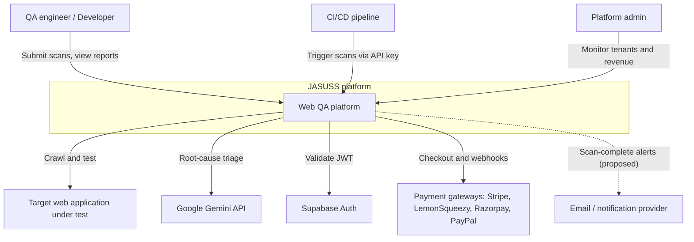
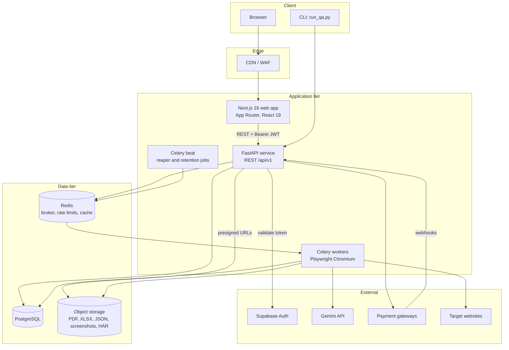
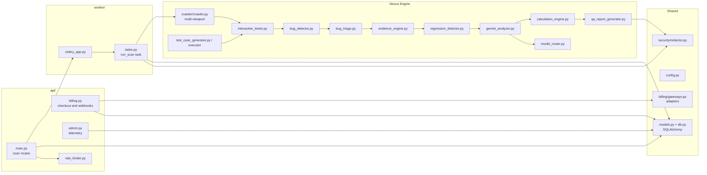
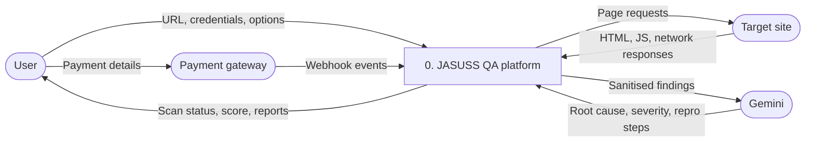
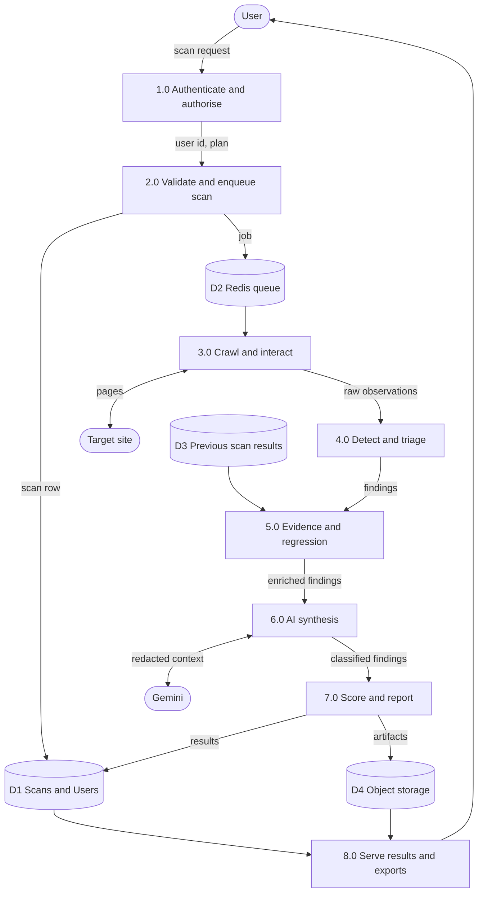
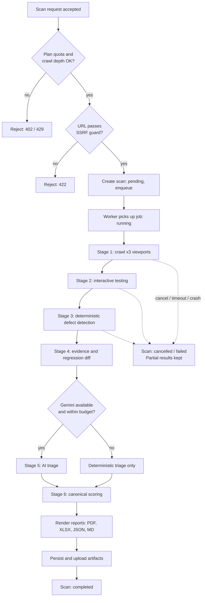
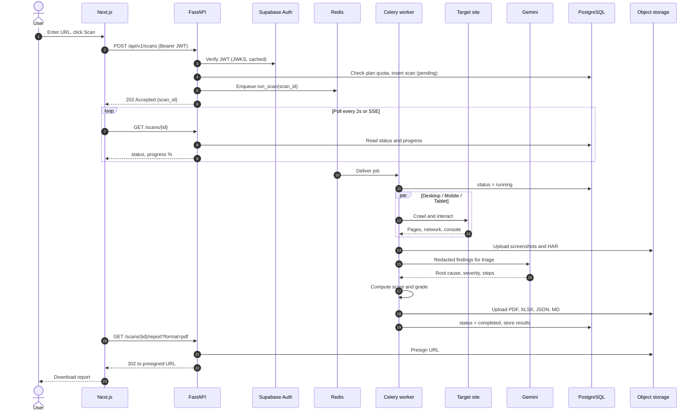
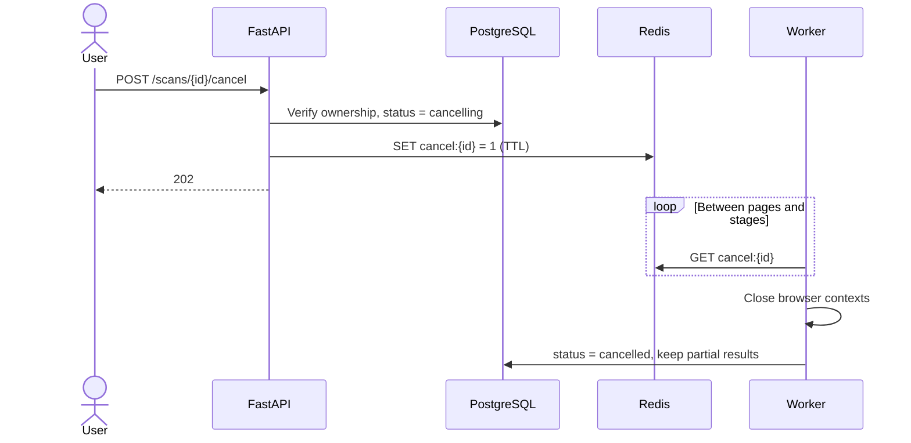
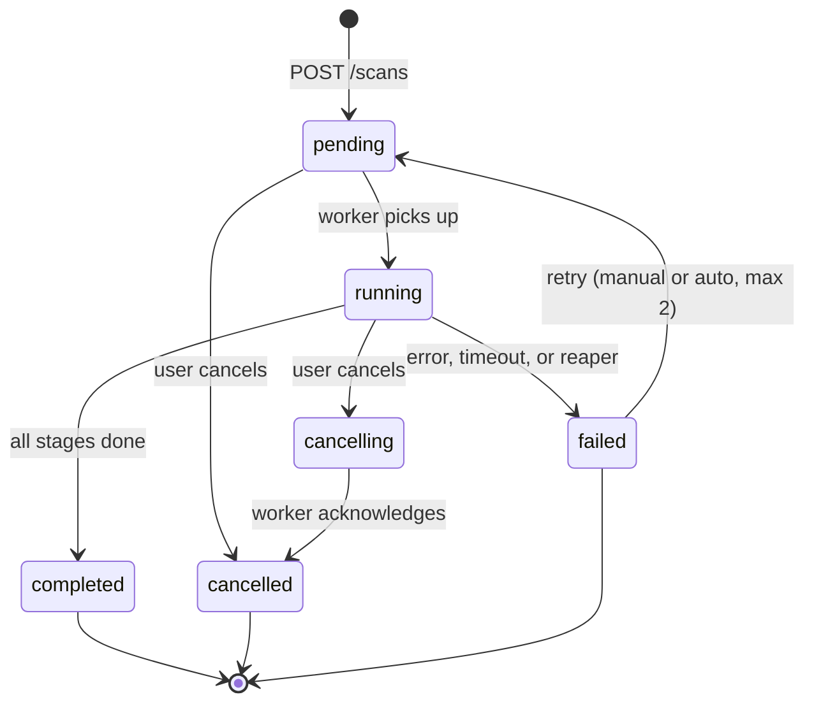
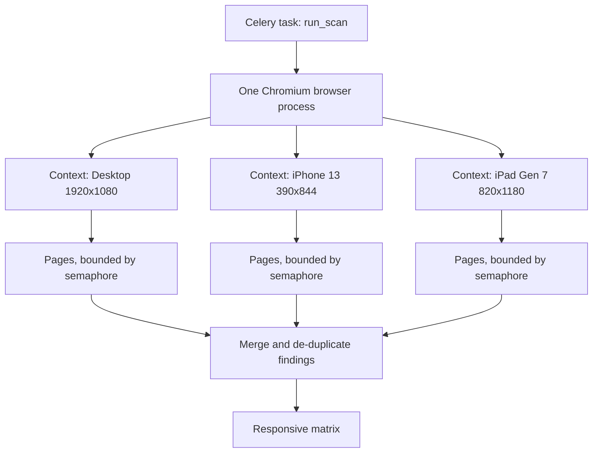

# Architecture

All diagrams use [Mermaid](https://mermaid.js.org/) and render natively on GitHub.

## Contents
1. [System context (C4 level 1)](#1-system-context-c4-level-1)
2. [Container view (C4 level 2)](#2-container-view-c4-level-2)
3. [Backend component view (C4 level 3)](#3-backend-component-view-c4-level-3)
4. [Data flow diagrams](#4-data-flow-diagrams)
5. [Scan pipeline](#5-scan-pipeline)
6. [Sequence: scan lifecycle](#6-sequence-scan-lifecycle)
7. [Scan state machine](#7-scan-state-machine)
8. [Multi-viewport concurrency model](#8-multi-viewport-concurrency-model)
9. [Design decisions](#9-design-decisions)
10. [Scaling model](#10-scaling-model)

---

## 1. System context (C4 level 1)

## 2. Container view (C4 level 2)

## 3. Backend component view (C4 level 3)

Maps the modules that exist in the repository to their responsibilities.

## 4. Data flow diagrams

### 4.1 Level 0: context DFD

### 4.2 Level 1: main processes

## 5. Scan pipeline

## 6. Sequence: scan lifecycle

### Cancellation

## 7. Scan state machine

## 8. Multi-viewport concurrency model

Isolation rules: one browser context per viewport, no shared cookies, contexts destroyed on task exit (including on exception), hard task time limit, and memory ceiling per worker container.

## 9. Design decisions

| Decision | Rationale | Trade-off |
|---|---|---|
| FastAPI + Celery instead of running scans in the API process | Browser work is CPU/RAM heavy and long-running; isolates failures and enables horizontal scaling | Requires Redis and worker operations |
| Deterministic detection first, AI second | Reproducible findings, lower cost, AI failures do not break the scan | AI adds value only on triage and explanation |
| `calculation_engine.py` as the single scoring source | Prevents score drift between UI, PDF, Excel and JSON | All consumers must call it, never recompute |
| SQLAlchemy as sole source of truth, Alembic migrations | Auditable schema history | Migration discipline required |
| Pydantic `SecretStr` for credentials, redaction layer | Zero credential leakage into DB, logs, reports, prompts | Credentials exist only in worker memory for the scan duration |
| Object storage for artifacts (proposed) | Multiple workers and API replicas cannot share local disk | Extra dependency |

## 10. Scaling model

| Component | Scales by | Signal |
|---|---|---|
| Web (Next.js) | Replicas / edge | CPU, latency |
| API | Replicas (stateless) | p95 latency, CPU |
| Workers | Replicas per queue | Queue depth and wait time |
| Redis | Managed HA | Memory, ops/s |
| PostgreSQL | Vertical + read replica | Connections, IOPS |

Queues (proposed): `qa_default`, `qa_priority` (Pro), `qa_enterprise` (dedicated node pool), `qa_reports`. Each worker container runs low concurrency (1–2 scans) because each scan owns a Chromium process.
