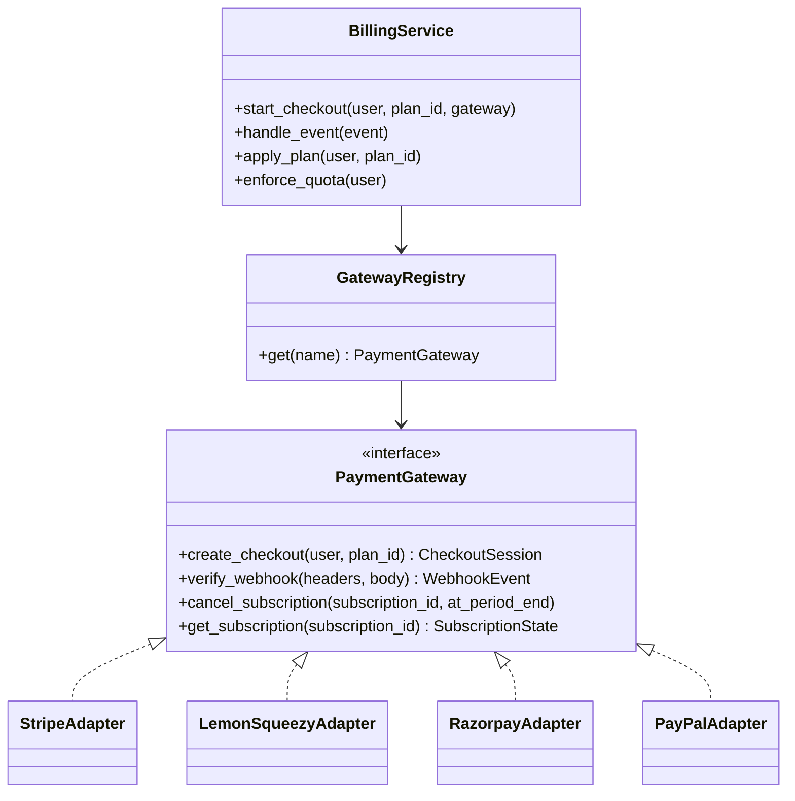
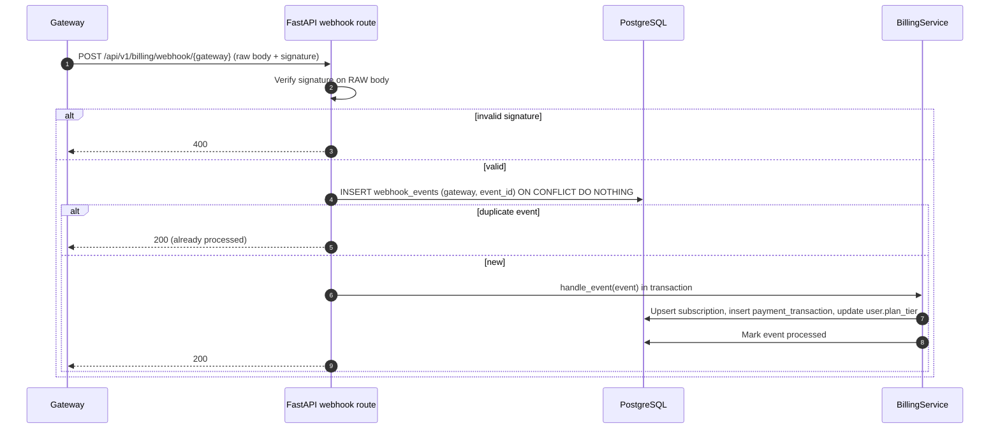
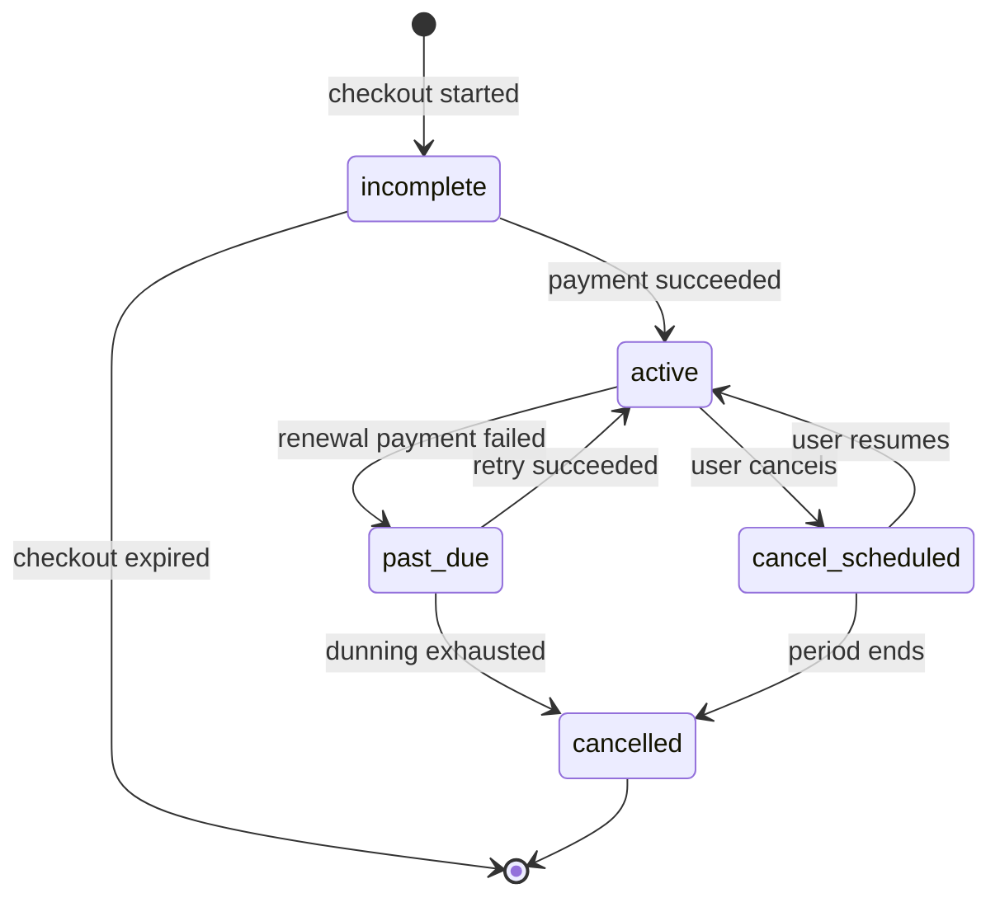
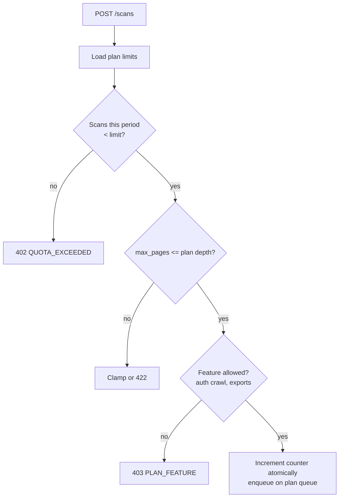

# Billing & Subscriptions

JASUSS supports four gateways behind one adapter interface (`billing/gateways.py`): **Stripe**, **LemonSqueezy**, **Razorpay**, **PayPal**.

## 1. Adapter design



The API layer talks only to `BillingService`; gateway-specific code stays inside adapters. Each adapter normalises events into a common `WebhookEvent {id, type, subscription_id, customer_id, amount, currency, status, occurred_at}`.

## 2. Checkout flow

```mermaid
sequenceDiagram
    autonumber
    actor U as User
    participant W as Web app
    participant A as FastAPI
    participant B as BillingService
    participant G as Gateway hosted checkout
    participant D as PostgreSQL

    U->>W: Choose Pro plan + gateway
    W->>A: POST /billing/checkout {plan_id, gateway} + Idempotency-Key
    A->>B: start_checkout(user, plan, gateway)
    B->>B: Price from server-side catalogue
    B->>G: Create session (metadata: user_id, plan_id)
    G-->>B: checkout_url
    B-->>A: checkout_url
    A-->>W: 200 {checkout_url}
    W->>G: Redirect user
    U->>G: Pay
    G-->>W: Redirect to success page
    Note over W,D: UI shows "Processing…"; plan changes only when the webhook arrives
```

The success redirect **never** upgrades the account. Only a verified webhook does.

## 3. Webhook handling (idempotent)

> **Implementation Note:** Gateway signature adapter verification is scaffolded in `billing/gateways.py`. Production environment secret lookup, the `webhook_events` table, and transactional idempotency handling described below are scheduled for Phase 2 hardening.



Rules:
- Read the **raw** request body for signature checks (do not re-serialise JSON).
- Return `2xx` quickly; move slow work to a Celery task if needed. Gateways retry on non-2xx.
- Out-of-order events: compare `occurred_at`/sequence and ignore stale updates.
- Persist every event (even failures) for replay and audit.

## 4. Subscription lifecycle



Effects on the user's `plan_tier`:

| Subscription state | Access |
|---|---|
| `active`, `cancel_scheduled` | Paid plan until `current_period_end` |
| `past_due` | Paid plan with 7-day grace, banner in UI |
| `cancelled` | Downgrade to `free`; keep data per retention policy |

## 5. Quota enforcement



Increment the counter in the same DB transaction that inserts the scan (`UPDATE users SET scans_used = scans_used + 1 WHERE … AND scans_used < limit RETURNING`) to avoid race conditions. Reset counters on the period boundary from the subscription's `current_period_end` (free tier: calendar month).

## 6. Plan catalogue

Keep in code/config, not in the database of a single gateway:

```yaml
plans:
  free:       { price_usd: 0,   scans_per_month: 10,   max_pages: 10,  queue: qa_default,    features: [multi_viewport, triage, score] }
  pro:        { price_usd: 49,  scans_per_month: 200,  max_pages: 50,  queue: qa_priority,   features: [multi_viewport, triage, score, auth_crawl, pdf_export, xlsx_export] }
  enterprise: { price_usd: 199, scans_per_month: null, max_pages: 500, queue: qa_enterprise, features: [all, custom_rules, sla] }
gateway_price_ids:
  stripe:       { pro: price_xxx, enterprise: price_yyy }
  lemonsqueezy: { pro: "12345",   enterprise: "12346" }
  razorpay:     { pro: plan_xxx,  enterprise: plan_yyy }
  paypal:       { pro: P-XXXX,    enterprise: P-YYYY }
```

## 7. Gateway dashboard instructions & notes

**Webhook Endpoint URL:** `https://api.jasuss.tech/api/v1/billing/webhook/{gateway}` (alias: `/webhook/{gateway}`)

| Gateway | Dashboard Setup & Webhook URL | Best for | Watch out for |
|---|---|---|---|
| Stripe | URL: `.../api/v1/billing/webhook/stripe`<br>Events: `checkout.session.completed`, `invoice.payment_succeeded`, `customer.subscription.deleted` | Cards, wallets | Use Checkout + Customer Portal; verify `Stripe-Signature` (`t=` and `v1=`) within 300s tolerance |
| LemonSqueezy | URL: `.../api/v1/billing/webhook/lemonsqueezy`<br>Events: `order_created`, `subscription_created`, `subscription_updated`, `subscription_cancelled` | Global tax as Merchant of Record | Fewer billing controls; map `subscription_*` events |
| Razorpay | URL: `.../api/v1/billing/webhook/razorpay`<br>Events: `payment.captured`, `subscription.activated`, `subscription.charged` | India: UPI, NetBanking | Amounts in paise; separate international-card setup |
| PayPal | URL: `.../api/v1/billing/webhook/paypal`<br>Status: Returns 501 until PayPal verify-webhook-signature API is integrated | Wallet users | Verify via the webhook verification API; subscription state sync |

## 8. Testing

- Unit-test each adapter with recorded fixtures (valid, invalid signature, duplicate, out-of-order).
- Integration: use gateway test/sandbox modes in staging; replay events with Stripe CLI or gateway dashboards.
- Property test: applying the same event N times yields the same DB state.
- Reconcile nightly: a job compares local subscriptions with gateway state and alerts on drift.

## 9. Financial reporting (admin console)

MRR = sum of monthly-normalised amounts of `active` and `cancel_scheduled` subscriptions. Compute from `subscriptions` + plan catalogue, not by summing transactions. Export reconciliation CSV per gateway per month.
