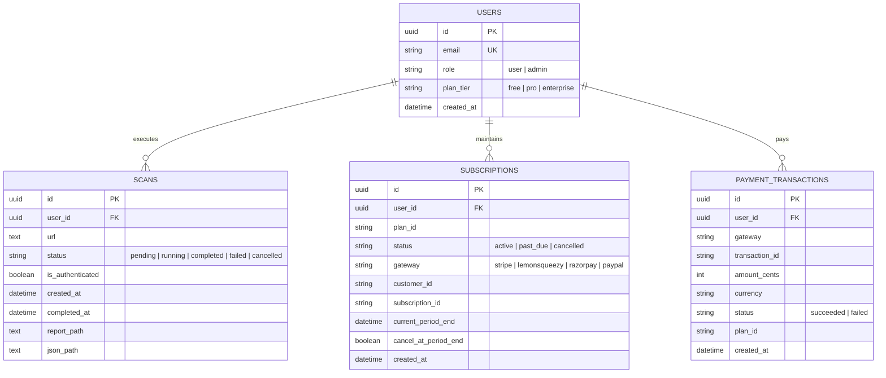
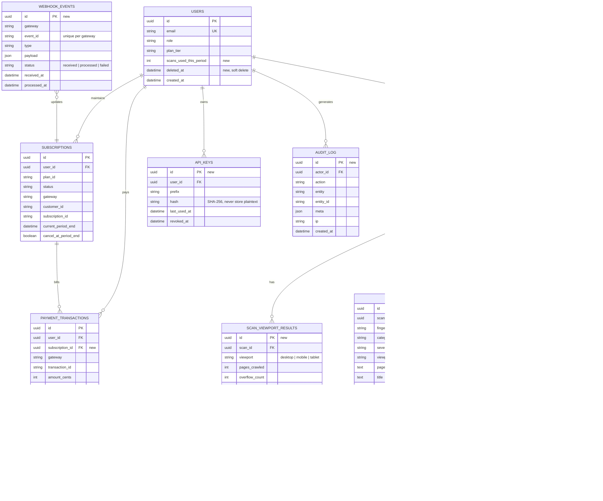

# Database

SQLAlchemy models are the single source of truth; schema changes ship only through Alembic migrations.

- Development: SQLite (`sqlite:///./qa_agent.db`)
- Production: **PostgreSQL 15+** (required; SQLite is not supported in production)

## 1. Current schema (from the repository README)

## 2. Proposed production schema (Target State: Phase 3)

> **Note on Migration Status:** The current database migration head is `003_add_subscriptions_and_plans.py`. The additions marked below (`findings`, `scan_artifacts`, `webhook_events`, etc.) define the target production schema to be introduced via Alembic migrations in Phase 3.  
> **Note on Tenant Isolation & RLS:** The FastAPI backend currently enforces tenant isolation at the query level (`Scan.user_id == user.id`). Row Level Security (RLS) is an optional direct-client database defence-in-depth layer.

Additions marked **(new)** normalise findings out of JSON blobs, support regression diffing, make webhooks idempotent, and add auditability.

## 3. Indexes and constraints

| Table | Index / constraint | Reason |
|---|---|---|
| `scans` | `(user_id, created_at DESC)` | Dashboard history |
| `scans` | `(status)` partial where status in (`pending`,`running`) | Reaper and admin inspector |
| `scans` | `(url_host, completed_at DESC)` | Baseline lookup for regression |
| `findings` | `(scan_id, severity)` | Report rendering |
| `findings` | `(fingerprint)` | Regression diff |
| `webhook_events` | unique `(gateway, event_id)` | Idempotent webhook handling |
| `subscriptions` | unique `(gateway, subscription_id)` | Prevent duplicates |
| `payment_transactions` | unique `(gateway, transaction_id)` | Prevent double-recording |
| `users` | unique `lower(email)` | Case-insensitive uniqueness |
| all FKs | `ON DELETE` explicit (`CASCADE` for scan children, `RESTRICT` for payments) | Data integrity |

## 4. Migration policy

1. Every schema change is an Alembic revision; never edit models without one.
2. CI runs `alembic upgrade head` on an empty DB **and** on a snapshot of the previous release (`test_database_migrations.py`).
3. Use **expand / contract** for zero-downtime: add nullable column, deploy code that writes both, backfill, switch reads, drop old column in a later release.
4. Migrations run as a separate release step (job), not on API start-up, once more than one API replica exists.
5. Each revision must be reversible or explicitly marked irreversible in its docstring.

## 5. Retention and privacy

| Data | Retention | Notes |
|---|---|---|
| Scan rows and findings | Per plan: Free 30 days, Pro 12 months, Enterprise configurable | Nightly retention job |
| Screenshots / HAR | 30 days default | Contain target-site content; treat as customer data |
| Reports (PDF/XLSX/JSON/MD) | Same as scan | Object-storage lifecycle rule |
| Webhook payloads | 90 days | Strip PII where possible |
| Audit log | 13 months minimum | Append-only |
| Credentials for authenticated crawls | **Never persisted** | Held in worker memory only |

Account deletion: soft-delete immediately, hard-delete personal data and artifacts within 30 days; financial records retained as required by law.

## 6. Connection management

- Pool per process: `pool_size=5`, `max_overflow=10`, `pool_pre_ping=True`, `pool_recycle=1800`.
- Use PgBouncer (transaction mode) when API replicas × workers exceed roughly 100 connections.
- Workers open short transactions; do not hold a DB session across the whole scan.
- Statement timeout 15 s for API, 60 s for workers.

## 7. Backup and recovery

| Item | Target |
|---|---|
| Backups | Daily full + continuous WAL archiving (PITR) |
| RPO | ≤ 5 minutes |
| RTO | ≤ 1 hour |
| Restore drill | Quarterly, documented in [OPERATIONS.md](OPERATIONS.md) |
