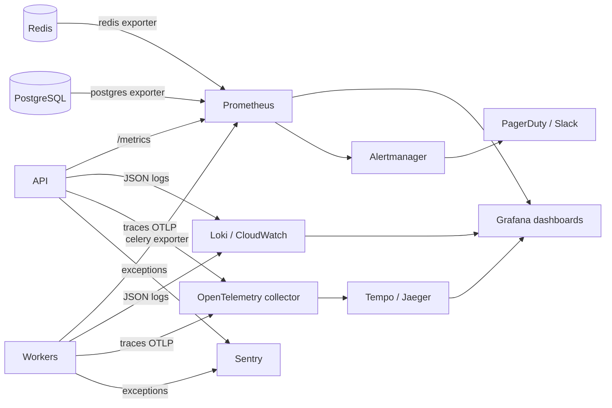
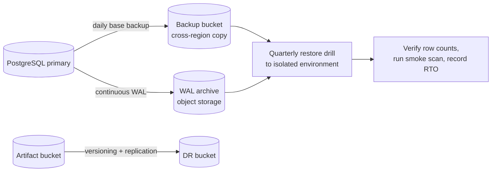

# Operations Guide

## 1. Service level objectives

| SLI | SLO | Measurement |
|---|---|---|
| API availability | 99.9% monthly | Non-5xx responses / total, excluding planned maintenance |
| API latency (non-scan routes) | p95 < 300 ms | Histogram at load balancer |
| Scan start latency | p95 < 60 s from `pending` to `running` (Pro: < 20 s) | `started_at - created_at` |
| Scan success rate | ≥ 97% of scans end `completed` or `cancelled` (not `failed`) | Excludes target-site outages classified as `TARGET_UNREACHABLE` |
| Report availability | 99.5% of completed scans have all 4 artifacts | Artifact rows vs expected |
| Webhook processing | 99.9% processed within 60 s | `processed_at - received_at` |

Error budget: 0.1% ≈ 43 minutes/month. When burned, freeze feature releases and prioritise reliability work.

## 2. Observability architecture



### Correlation
Generate `request_id` at the edge (or API middleware), pass it to Celery task headers, and log `request_id`, `scan_id`, `user_id` (hashed), `viewport`, `stage` on every line. A single `scan_id` must be enough to reconstruct a scan across API, worker and DB.

### Key metrics

| Metric | Type | Alert use |
|---|---|---|
| `http_requests_total{route,status}` | counter | 5xx rate |
| `http_request_duration_seconds` | histogram | latency SLO |
| `scans_created_total{plan}` | counter | traffic anomalies |
| `scans_finished_total{status}` | counter | success-rate SLO |
| `scan_duration_seconds{stage}` | histogram | slow stage detection |
| `scan_queue_depth{queue}` | gauge | scale-out and backlog alerts |
| `scan_queue_wait_seconds{queue}` | histogram | start-latency SLO |
| `worker_chromium_rss_bytes` | gauge | memory leak detection |
| `ai_requests_total{status}`, `ai_cost_usd_total` | counter | Gemini failures and budget |
| `ssrf_blocked_total` | counter | abuse detection |
| `webhook_events_total{gateway,status}` | counter | billing health |
| `db_pool_in_use` | gauge | connection exhaustion |

## 3. Alerts

| Severity | Condition | Action |
|---|---|---|
| **Page** | API 5xx > 2% for 5 min | Runbook R1 |
| **Page** | `/readyz` failing on all replicas | R2 |
| **Page** | Queue wait p95 > 5 min for 10 min | R3 |
| **Page** | Webhook failures > 5 in 10 min for any gateway | R5 |
| **Page** | Postgres down or replication lag > 60 s | R6 |
| **Ticket** | Scan failure rate > 10% for 30 min | R4 |
| **Ticket** | Worker memory > 85% for 15 min | Increase limits or reduce concurrency |
| **Ticket** | AI failure rate > 20% or daily cost > budget | Check quota, switch model in router |
| **Ticket** | Disk/object storage growth anomaly | Verify retention job |
| **Ticket** | Certificate expiry < 14 days | Renew |

## 4. Background jobs (Celery beat)

| Job | Schedule | Purpose |
|---|---|---|
| `reap_stuck_scans` | every 5 min | Mark `running` scans with no heartbeat for > 20 min as `failed` |
| `apply_retention` | daily 02:00 UTC | Delete expired scans, artifacts, webhook payloads |
| `reconcile_subscriptions` | daily 03:00 UTC | Compare local subscriptions to gateway state |
| `reset_period_quotas` | hourly | Roll quota counters at period boundary |
| `refresh_jwks` | every 10 min | Warm JWKS cache |
| `db_maintenance_stats` | daily | Emit table sizes, bloat |

Workers write a **heartbeat** (`scans.updated_at` or Redis key with TTL) every 30 s during a scan so the reaper can distinguish slow from dead.

## 5. Celery configuration baseline

```python
task_acks_late = True
task_reject_on_worker_lost = True
worker_prefetch_multiplier = 1          # long tasks: no hoarding
task_soft_time_limit = 900
task_time_limit = 1000
broker_transport_options = {"visibility_timeout": 3600}
task_default_retry_delay = 30
task_annotations = {"*": {"max_retries": 2, "retry_backoff": True, "retry_jitter": True}}
worker_max_tasks_per_child = 20         # recycle to bound Chromium leaks
task_routes = {
    "worker.tasks.run_scan": {"queue": "qa_default"},   # overridden per plan at enqueue time
}
```

Idempotency: `run_scan` must be safe to re-run for the same `scan_id` (check status first, overwrite artifacts by deterministic key).

## 6. Runbooks

### R1: High API error rate
1. Check Grafana → API dashboard: which route, which status?
2. `kubectl logs`/log query by `request_id` for a sample 5xx.
3. Common causes: DB pool exhausted (`db_pool_in_use`), Redis down, bad deploy.
4. If correlated with a deploy in the last 30 min → roll back (see [DEPLOYMENT.md](DEPLOYMENT.md#8-release-and-rollback)).
5. If DB pool: scale API down/up, raise pool or add PgBouncer, look for long transactions.

### R2: Readiness failing
1. `GET /readyz` returns which dependency is failing (DB or Redis)?
2. Verify managed service status, security groups, credentials rotation.
3. API should shed load with `503` and `Retry-After`; do not restart-loop.

### R3: Queue backlog
1. Check `scan_queue_depth` and worker count per queue.
2. Scale the affected worker deployment; confirm nodes have capacity.
3. Check for a single tenant flooding: query scans by `user_id` in the last hour; apply temporary limit.
4. Check for stuck workers (`celery inspect active`), restart hung pods.

### R4: Elevated scan failures
1. Group failures by `error_code` (`TARGET_UNREACHABLE`, `TIMEOUT`, `BROWSER_CRASH`, `AI_ERROR`, `SSRF_BLOCKED`).
2. `BROWSER_CRASH`: check memory limits and `/dev/shm`; check Playwright/Chromium version drift.
3. `TIMEOUT`: check whether target sites are slow vs our egress proxy.
4. `AI_ERROR`: confirm deterministic fallback is completing scans; check Gemini quota.

### R5: Payment webhook failures
1. Look at `webhook_events` where `status = 'failed'`.
2. Signature failures → secret rotated or wrong environment (test vs live).
3. Fix, then **replay** failed events from the gateway dashboard or via an admin replay command; idempotency makes replay safe.
4. Run `reconcile_subscriptions` manually.

### R6: Database incident
1. Failover to standby (managed service) or promote replica.
2. Confirm app reconnects (`pool_pre_ping`).
3. For data corruption: stop writers, restore PITR to a new instance to a timestamp before the incident, validate, cut over.

### R7: Suspected credential leak
1. Rotate affected secret in the secret manager, redeploy.
2. Search logs for the value's fingerprint; purge if found.
3. Notify per [SECURITY.md](SECURITY.md#13-incident-response-short-form).

## 7. Backup and disaster recovery



| Asset | Backup | RPO | RTO |
|---|---|---|---|
| PostgreSQL | Base + WAL | ≤ 5 min | ≤ 1 h |
| Artifacts | Versioned, cross-region | ≤ 15 min | ≤ 2 h (regenerable reports can be rebuilt from findings) |
| Redis | AOF; treated as **disposable** (queue can be re-enqueued from `pending` scans) | n/a | minutes |
| Secrets | Secret-manager replication | n/a | minutes |
| IaC and config | Git | n/a | n/a |

Redis recovery: on restart run `requeue_pending_scans` to re-enqueue `pending` and stale `running` scans.

## 8. Capacity planning

- Track: scans/day by plan, avg pages per scan, avg scan seconds, Chromium RSS, artifact bytes per scan.
- Rule of thumb: `workers_needed = peak_scans_per_hour × avg_scan_minutes / 60 / concurrency_per_worker`, with 30% headroom.
- Review monthly; load test before launches with a synthetic target site (a static site that includes known defects so results are verifiable).

## 9. Load and chaos testing

| Test | Tool | Pass criterion |
|---|---|---|
| API load | k6/Locust: 200 rps on read routes | p95 < 300 ms, no 5xx |
| Scan burst | 500 scans in 5 min against the demo target | Queue drains < 30 min, no lost scans |
| Worker kill | Kill workers mid-scan | Scans retried or marked failed by reaper; none stuck |
| Redis restart | Restart broker | Pending scans requeued; API returns clean errors |
| DB failover | Trigger failover | Recovery < 2 min |
| Gemini outage | Block egress to Gemini | Scans still complete with deterministic triage |

## 10. Maintenance checklist

**Weekly:** review error budget, failed webhooks, top failing target domains, dependency PRs.
**Monthly:** rotate any expiring keys, review access, cost report, storage growth, Playwright/Chromium upgrade in staging.
**Quarterly:** restore drill, chaos tests, threat-model review, revisit rate limits and plan quotas.
