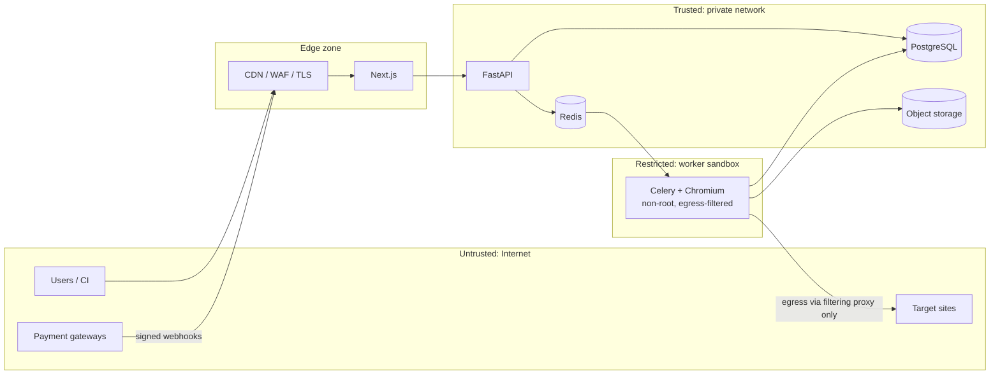
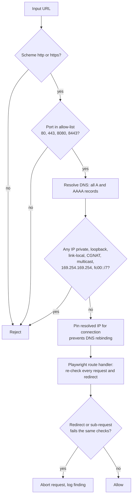

# Security

JASUSS makes outbound requests to arbitrary user-supplied URLs with a real browser, holds customer credentials briefly, and processes payments. That combination makes **SSRF, credential handling and worker isolation** the top risks.

## 1. Trust boundaries

Rule: **workers can reach the internet, but never the private network, cloud metadata service, or the DB admin surface.** Workers get a DB role with minimum privileges.

## 2. Threat model (STRIDE summary)

| # | Threat | Vector | Mitigation |
|---|---|---|---|
| T1 | SSRF into internal services | Scan URL, redirects, page-initiated requests | Section 3 |
| T2 | Malicious target site attacks worker | Browser exploit, download bombs, infinite pages | Sandbox, resource limits, no downloads, non-root |
| T3 | Credential leakage | Login creds in logs, DB, reports, AI prompts | `SecretStr`, redactor, prompt scrubbing, tests |
| T4 | Forged payment events | Fake webhook | Signature verification + event dedupe |
| T5 | Privilege escalation / IDOR | Guessing scan ids | Ownership check on every query; 404 not 403 |
| T6 | JWT abuse | Expired/foreign tokens | Verify `iss`, `aud`, `exp`, algorithm allow-list, JWKS |
| T7 | Abuse / resource exhaustion | Scan floods, huge crawl | Quotas, rate limits, depth caps, task time limits |
| T8 | Prompt injection via page content | Target page text steers Gemini | Treat page text as data, strict JSON schema output, no tool access, validate output |
| T9 | Supply chain | Malicious dependency | Lockfiles, Dependabot, SCA and image scan in CI |
| T10 | Data exposure at rest | Public bucket, leaked backup | Private buckets, encryption, presigned short-lived URLs |
| T11 | CSRF / XSS in dashboard | Rendering findings from target pages | Escape all target-derived strings, strict CSP, Bearer tokens not cookies |

## 3. SSRF defence for the crawler

> **Implementation Note:** The API currently enforces string-based hostname/IP blocklisting (`api/main.py`). The full DNS resolution (A/AAAA checks, DNS rebinding prevention, port filtering) and Playwright `context.route` sub-request/redirect guard illustrated below are scheduled for implementation in Phase 2.

Validate **before** enqueue and **again** at request time inside the worker.

Checklist:
- Block: `127.0.0.0/8`, `10.0.0.0/8`, `172.16.0.0/12`, `192.168.0.0/16`, `169.254.0.0/16`, `100.64.0.0/10`, `::1`, `fc00::/7`, `fe80::/10`, and `file:`, `ftp:`, `gopher:`, `chrome:` schemes.
- Enforce at the network layer too: Kubernetes `NetworkPolicy` or security-group egress rules that deny RFC1918 and metadata ranges from the worker subnet. Application checks alone are not sufficient.
- Cap redirects (≤ 5), page count, total bytes, per-page timeout, per-scan wall clock.
- Optional: allow-list mode for Enterprise (verified domains via DNS TXT or file proof) to prove ownership of the target.

## 4. Worker isolation

- Container runs as non-root, read-only root filesystem, `tmpfs` for `/tmp`, `--cap-drop=ALL`, seccomp default profile.
- One Chromium per task, contexts destroyed on exit; `--no-sandbox` **must not** be used unless the container itself provides isolation (document the exception if needed).
- Disable downloads, permissions prompts, service workers, and WebRTC.
- Resource ceilings: CPU and memory limits per container; Celery `soft_time_limit`/`time_limit` per task.
- No cloud credentials mounted in worker pods; use a scoped role for the single object-storage prefix.

## 5. Secrets and credentials

| Secret | Storage | Rotation |
|---|---|---|
| DB password, Redis, Gemini, gateway keys | Secret manager (AWS SM / GCP SM / Vault), injected at runtime | 90 days or on incident |
| Supabase JWT config | Secret manager | On rotation event |
| Webhook signing secrets | Secret manager | On gateway rotation |
| Customer target credentials | **Memory only**, cleared after the scan | n/a |
| API keys (customer) | SHA-256 hash at rest, shown once | User-initiated |

Enforcement:
- `gitleaks`/`trufflehog` in CI and as a pre-commit hook.
- `security/redactor.py` applied to logs, findings, reports and AI prompts; keep `test_redaction.py` covering passwords, tokens, cookies, `Authorization` headers, and HAR bodies.
- HAR capture must strip `Authorization`, `Cookie`, `Set-Cookie` and form password fields.

## 6. Authorization (RBAC)

| Resource | user | admin |
|---|---|---|
| Own scans / reports | read, create, cancel, delete | read all |
| Other users' scans | 404 | read, cancel |
| Billing (own) | manage | view all |
| `/admin/*` | 403 | full |
| API keys (own) | manage | revoke any |

Implement as a FastAPI dependency (`require_role("admin")`) and a query helper that always scopes by `user_id`. Add tests asserting cross-tenant access returns 404.

## 7. Application hardening

- HTTPS everywhere, HSTS (`max-age=31536000; includeSubDomains`), TLS 1.2+.
- Security headers on web: strict `Content-Security-Policy`, `X-Content-Type-Options`, `Referrer-Policy`, `Permissions-Policy`, frame-ancestors none.
- CORS: exact origins via `CORS_ALLOWED_ORIGINS`; no wildcard with credentials.
- Input validation with Pydantic V2 (`HttpUrl`, length limits, enums).
- Escape or sanitise all target-derived text (titles, console logs) when rendering in web, PDF and Excel (guard against CSV/Excel formula injection: prefix `=`, `+`, `-`, `@` cells with `'`).
- Return generic errors; log details server-side with `request_id`.
- Uploads: none accepted. Artifacts are only generated by workers.

## 8. Payments security

- Never handle raw card data; use hosted checkout from each gateway (PCI SAQ-A scope).
- Verify signatures (Stripe `Stripe-Signature`, LemonSqueezy `X-Signature`, Razorpay `X-Razorpay-Signature`, PayPal webhook verification API).
- Reject events older than 5 minutes when the gateway provides timestamps; store `event_id` for idempotency (see [BILLING.md](BILLING.md)).
- Never trust client-reported plan or price; derive from server-side plan catalogue.

## 9. AI-specific controls

- Send Gemini only what is needed: finding metadata and short redacted snippets, never credentials, cookies, or full HAR bodies.
- Require structured JSON output validated by Pydantic; discard non-conforming responses and fall back to deterministic severity.
- Cap tokens and cost per scan (`model_router.py` budget); circuit-breaker on repeated failures.
- Log prompt/response hashes, not contents, in production.

## 10. Logging, audit and detection

- Structured JSON logs; never log request bodies for `/scans` or `/billing`.
- Audit log entries for: login-related admin actions, plan changes, scan deletion, API key create/revoke, admin data access.
- Alert on: spike in SSRF rejections, repeated 401/403 from one IP, webhook signature failures, worker egress to blocked ranges.

## 11. Compliance posture

| Topic | Approach |
|---|---|
| GDPR / privacy | Data map, DPA with subprocessors (Supabase, Google, payment gateways, cloud), export and delete on request, retention in [DATABASE.md](DATABASE.md#5-retention-and-privacy) |
| Terms of use | Require the user to attest they are authorised to test the target; log acceptance |
| Robots / rate courtesy | Honour configurable crawl delay; identifiable User-Agent `JASUSS-Nexus/1.x (+url)` |
| SOC 2 readiness | Access reviews, change management via PRs, backup tests, incident log |

## 12. Vulnerability management

- Dependabot or Renovate weekly; critical CVEs patched within 7 days.
- CI: `pip-audit`, `npm audit`, `bandit`, container scan (Trivy), secret scan (gitleaks).
- Security contact: publish `SECURITY.md` at the repo root with a disclosure address and 90-day coordinated disclosure policy.

## 13. Incident response (short form)

1. Detect and page on-call; open an incident channel.
2. Contain: revoke keys, disable affected worker pool, block IPs.
3. Eradicate and recover: rotate secrets, redeploy from known-good image.
4. Notify affected users and regulators where required (GDPR: 72 hours).
5. Post-incident review within 5 business days, tracked action items.
